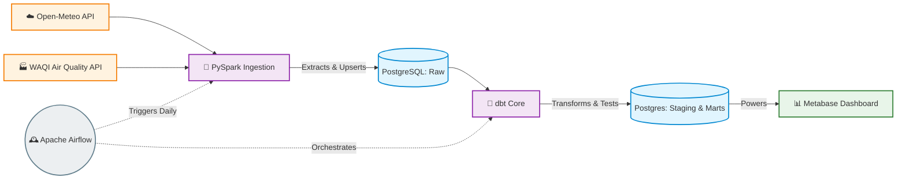

<div align="center">
  <h1>🌤️ EcoMetrics: End-to-End Weather & AQI Pipeline</h1>
  
  
  
  
  
  
  

  > An automated, fault-tolerant Data Engineering pipeline ingesting real-time weather and air quality data, transforming it via PySpark and dbt, and surfacing analytics in a Metabase Dashboard.
</div>

---

## 🏗️ System Architecture & High-Level Design

EcoMetrics is designed using modern Data Engineering principles. It relies on a containerized infrastructure to extract, load, and structurally model environmental data.



### 🔁 Data Flow Lifecycle
1. **Extraction**: Apache Airflow triggers daily at `08:00 UTC`, pinging the Open-Meteo and OpenAQ (WAQI) APIs.
2. **PySpark Processing**: Raw JSON payloads are loaded into Spark DataFrames. Arrow typing enforces strict schemas while nulls and missing records are filtered out.
3. **Loading**: Data is written via JDBC directly into a local PostgreSQL warehouse (`raw` schema) utilizing an idempotent *upsert* sequence (`ON CONFLICT DO UPDATE`).
4. **Transforming (dbt)**: `dbt Core` processes the raw data. It standardizes inputs in the `staging` tier and performs complex aggregations in the `marts` tier (creating daily summary constraints and joining weather + PM2.5 metrics).
5. **Quality Assurance**: `dbt test` runs automatically alongside GitHub Actions CI workflows, utilizing assertions like `accepted_values`, `not_null`, and `unique` to ensure analytical accuracy.
6. **Analytics**: Metabase points directly to the optimized `public_marts.mart_combined_daily` table to host dynamic dashboard reporting.

---

## 🛠️ Tech Stack & Roles

| Tool | Purpose | Status / Access |
| :--- | :--- | :---: |
| **Python 3.10** | Core programming language for API requests and logic | Open Source |
| **PySpark** | In-memory distributed data transformation and DataFrame manipulation | Open Source |
| **PostgreSQL** | Relational Database acting as the central Data Warehouse | Local Container |
| **dbt Core** | SQL-first data transformation, testing, and modeling | Local Executable |
| **Apache Airflow** | Workflow orchestration, dependencies, and Slack alerting | UI: `port 8080` |
| **Docker Compose** | Containerization of underlying services | Infrastructure |
| **Metabase** | BI Dashboard for data visualization | UI: `port 3000` |
| **Pytest** | Continuous Integration unit testing | GitHub Actions |

---

## 📂 Project Structure

```text
Ecometrics-data-pipeline/
├── .github/workflows/       # CI/CD Pipeline executing pytest
├── dags/                    # Airflow DAGs
│   ├── utils/
│   │   └── pipeline_monitor.py  # Custom logic & Slack Alerts
│   └── weather_pipeline_dag.py  # Orchestration logic
├── dbt_project/             # Data Build Tool configurations
│   ├── models/
│   │   ├── marts/               # Final Fact / Aggregated tables + Schema tests
│   │   └── staging/             # Cleaned view models + Schema tests
│   ├── dbt_project.yml
│   └── packages.yml
├── ingestion/               # Python/PySpark extraction logic
│   ├── fetch_aqi.py
│   └── fetch_weather.py
├── lib/                     # JDBC and system dependencies
├── logs/                    # Local outputs
├── scripts/                 # Execution run configuration
│   ├── run_pipeline.sh
│   ├── verify_data.py
│   └── view_docs.bat
├── tests/                   # Pytest testing suite
├── .env.example
├── docker-compose.yml       # Primary infrastructure definitions
├── requirements.txt
└── README.md
```

---

## 🚀 Quick Start / Setup Instructions

### Prerequisites
- Docker and Docker Compose
- Python 3.10+
- Git

### Installation & Execution

1. **Clone the repository**
```bash
git clone https://github.com/Mkatika37/Ecometrics-data-pipeline.git
cd Ecometrics-data-pipeline
```

2. **Establish Configuration**
```bash
cp .env.example .env
# Edit .env and supply your credentials (e.g., Slack Webhook, API tokens)
```

3. **Spin up the infrastructure**
```bash
docker-compose up -d
```

4. **Initialize the database schemas & Fetch initial data via PySpark**
```bash
bash scripts/run_pipeline.sh
```

5. **Access UIs**
- **Apache Airflow**: Open `http://localhost:8080` to trigger or evaluate the DAG.
- **Metabase**: Open `http://localhost:3000` to view the dashboards connected to the Postgres warehouse.
- **dbt Docs**: Run `scripts/view_docs.bat` to see the generated data lineage.

---

## 🧠 Core Engineering Principles Applied

- **Idempotency**: All ingestion and dbt models are designed so that the pipeline can run multiple times a day without generating duplicate records. Data is intelligently upserted based on `timestamp` and `city` keys.
- **Data Quality Alerts**: Configured Airflow's native `on_failure_callback` to post immediate logging and error tracking directly to an active Slack channel.
- **Lineage Tracking**: Implemented `dbt docs` generation to visualize exactly where and how fields map.
- **Automated CI/CD**: Added robust GitHub actions workflow ensuring zero regressions when scaling or modifying PySpark components.